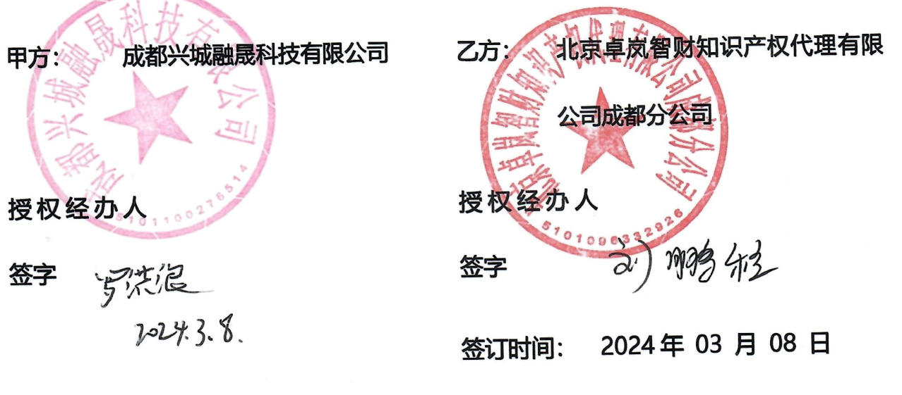

# 外观专利代理服务合同  

受托方（乙方）：北京卓岚智财知识产权代理有限公司成都分公司  

<html><body><table><tr><td>委托人（甲方）：</td><td colspan="3">成都兴城融晟科技有限公司</td></tr><tr><td>委托人地址：</td><td colspan="3">中国（四川）自由贸易试验区天府新区正兴街道蜀州路2828号</td></tr><tr><td>经办人：</td><td colspan="3">马文彦</td></tr><tr><td>手机：</td><td>18111560015</td><td>Email:</td><td>mawy@xcsupplychain.com</td></tr><tr><td>经办人：</td><td colspan="3">罗洪浪</td></tr><tr><td>手机：</td><td>18783088031</td><td>Email:</td><td>luohl@xcsupplychain.com</td></tr><tr><td>受托人（乙方）：</td><td colspan="3">北京卓岚智财知识产权代理有限公司成都分公司</td></tr><tr><td>受托人地址：</td><td colspan="3">中国（四川）自由贸易试验区成都高新区益州大道中段888号1栋1 单元19层13号</td></tr><tr><td>经办人：</td><td colspan="3">刘鹏程</td></tr><tr><td>手机：</td><td>17343018116</td><td>Email:</td><td>joe.liu.tcan@qq.com</td></tr></table></body></html>  

根据中华人民共和国《民法典》、《专利法》、《专利法实施细则》的规定，在平等自愿基础上，甲乙双方就专利申请等相关事务达成如下长期合作合同。  

# 一、乙方知识产权服务的内容  

为了更好地为甲方服务，乙方需成立专利代理服务项目组，具体要求如下：  

1.1项目组组长需具备7年及以上的专利代理服务经验，乙方项目组成员不少于3人（包括项目组组长在内）。乙方项目组为甲方提供专利代理服务相关事宜。  

# 1.2 专利申请  

（1）专利申请中阶段：  

甲方提供材料完全后，乙方须在7个工作日内完成符合上报条件的外观专利申请材料，并发送给甲方授权经办人确认，甲方确认后的三个工作日内，乙方须将甲方确认好的外观专利申请材料递交至国家知识产权局专利局；  

（2）审查阶段收到的所有补正和审查意见，乙方需主动告知甲方，并将答复或修改内容发送给甲方确认后，由乙方负责反馈至国家知识产权局专利局（限乙方代理的专利）；  

（3）专利授权后乙方将甲方所有授权专利按申请日期录入年费监控系统，年费到期前一个月通过邮件提醒缴费。  

1.3乙方为甲方免费提供不少于一场的知识产权相关培训；  

1.4参加甲方关于知识产权方面的重要经济活动，提出专业意见，处理有关事务；  

1.5免费指导、协助甲方建立知识产权管理机构、管理人员工作职责、工作流程等；  

1.6免费指导、协助甲方建立知识产权管理制度；  

1.7 对甲方专利被侵权或被他人控告侵权免费出具1份全面的是否侵权的专业分析意见书，超出的份数，双方另行商定相关费用；  

1.8免费审核甲方的产品包装、对是否涉嫌违反《商标法》《广告法》《专利法》等不规范使用、是否侵权出具专业意见；  

1.9乙方应整理本合同所涉及的外观专利代理申请项目档案，并移交甲方。  

# 二、服务收费标准及付款方式  

2.1服务收费标准（单位：RMB），如表2.1所示：  

1、专利部分  

<html><body><table><tr><td>序号</td><td>业务类型</td><td>费用 （单位： 元）</td><td>系统涉及 专利申请 个数</td><td>单位</td><td>备注</td></tr><tr><td></td><td>兴城统一登录 系统外观专利 申请代理服务</td><td>1080.00</td><td>1</td><td>件</td><td>1、费用明细: 代理费：580.00元； 官费：500.00元，合计：1080.00 元； 2、含申请规划、图片处理和答复： 6个月左右结案（体结案时间以官方 下发的授权或驳回通知书为准。）</td></tr></table></body></html>  

表2.1：服务收费标准  

<html><body><table><tr><td>2</td><td>资产管理系统 外观专利申请 代理服务</td><td>1080.00</td><td>3</td><td>件</td><td>1、费用明细: 代理费：580.00元/件; 官费：500.00元/件，合计：3240.00 元； 2、含申请规划、图片处理和答复： 6个月左右结案（体结案时间以官方 下发的授权或驳回通知书为准。)</td></tr><tr><td>3</td><td>人力资源系统 外观专利申请 代理服务</td><td>1080.00</td><td>1</td><td>件</td><td>1、费用明细: 代理费：580.00元； 官费：500.00元，合计：1080.00 元； 2、含申请规划、图片处理和答复： 6个月左右结案(体结案时间以官方</td></tr><tr><td colspan="8">下发的授权或驳回通知书为准。)</td></tr></table></body></html>  

注：  

1）对于甲方专利授权后所产生的印花税费及年费（具体以官方出具的相应通知为准）由甲方自行承担，甲方可以委托乙方帮助缴纳，乙方不再另外收取服务费。  

2）乙方代理专利过程中所涉及的专利服务费由乙方开具税率为【3%】增值税专用发票（国家税务局税率优惠或另有政策时，以国家税务局颁布的最新政策为准）；专利官费部分以官方收据或乙方开具增值税普通发票为准。  

2.2 甲方应对代理价格保密,不得泄露给任何第三人,遇法律诉讼情况除外。  

2.3 本合同签订之日起生效，具体业务交办过程中，甲乙双方不再单独签订《知识产权代理委托合同》，直接由甲方指派的授权经办人发委托邮件或业务确认单（附件1）给乙方经办人确认，该委托邮件或业务确认单作为双方结算转款、  

开票依据。  

2.4本合同所涉及费用支付范围及支付方式：  

2.4.1代理费和官费支付方式：甲方在收到相应专利的受理通知书、官费收据、服务费发票后的15个工作日内向乙方支付相应款项。  

2.4.2甲方委托乙方代理的专利申请，且已授权的专利年费，乙方有义务在专利年费缴纳期限到期前1个月(每个月 28 日前提供下个月的年费缴费明细)向甲方以书面或电子件形式提示。  

2.4.3甲方新申请专利所产生的官费，乙方有义务在国家知识产权局发布费用缴纳通知书的2个工作日内以书面形式通知甲方。  

2.4.4乙方账户信息如下：  

账户名称：北京卓岚智财知识产权代理有限公司成都分公司  

账 号：636501444  

开户行：中国民生银行股份有限公司成都铁像寺支行  

注：汇款时，请您在账户名称后加注“成都分公司”，否则会导致银行退款。  

# 三、双方权利、义务  

3.1甲方权利、义务  

（1）甲方有权对乙方的代理工作进行监督并提出意见；如乙方对甲方提出的意见不予重视或处理后果让甲方不满意，则甲方有权终止本合同。  

（2）甲方在办理知识产权事务时，尽其所能提供真实、可靠的信息、资料,其信息、资料的完整性需乙方进行专业的判断，甲方提供的信息、资料不真实或不可靠，从而造成乙方的决策判断、业务行为失误，以及造成其他不良后果，由甲方负全部责任。  

(3）甲方应在上述条款约定时限内及时支付乙方办理专利有关事务的服务费用。  

# 3.2乙方权利、义务  

（1）乙方有义务对甲方所提供的信息、资料保密，如未经甲方同意对外泄密，应承担相应的责任，如给甲方造成了损失，应按相应损失予以赔偿。  

（2）乙方代理人应按照行业公认的执业标准和勤勉尽责的职业道德为甲方提供优质服务。  

（3）甲方与乙方合作事务，若乙方认为与乙方客户存在权利冲突的，乙方将与甲方进行协商是否代理。  

（4）乙方应在接到国家知识产权局关于递交专利的任何反馈文件和信息后的3个工作日内以邮件形式告知甲方。  

（5）乙方应根据《专利法》、《著作权法》、《计算机软件保护条例》和《计算机软件著作权登记办法》相关法规忠实勤勉地实施知识产权代理工作。在本合同履行的过程中,乙方有义务随时解答甲方提出的与知识产权事项相关的问题。  

3.3乙方后续的免费服务：  

（1）制度严密、流程规范。  

专利代理人、质检部经理、专利公司经理三重把关，从制度上保障了决不会出现漏报、错报、晚报的情况。  

（2）有专门的部门（客户服务部），按标准化流程作业为甲方提供专业的专利后续服务。  

a、为甲方的专利建立终身档案，全程记录该专利的所有有关情况;  

b、全程跟踪整个申请过程，报送当天以传真或者邮件形式返电子版的申请递交回执或受理通知书。  

c、领证后三年内不时提醒甲方正确使用专利，及时办理变更、转让、许可等，适当使用专利，以免丧失专利权。  

（3）免费咨询，提供专业建议。  

在本合同签订后乙方为甲方提供专业咨询服务,根据甲方在知识产权管理方面存在的问题并结合乙方的经验提供专业、全面的知识产权管理建议，在甲方认可的基础上，积极执行。  

# 3.4关于通知的约定  

（1）在合同有效期间，乙方对专利申请相关的文件、文书转递和通知承担合同义务。乙方就有关法律文书及通知应当及时以面交或电子邮件或快递邮寄或甲方指定的方式按甲方提供的地址和经办人通知甲方。  

（2）如有本合同中所列的“经办人”、“经办人电话”、“经办人Email”等中任何一项联系信息发生变化时，双方务必及时通知对方，否则，因此而造成的后果由相应过错方负责。乙方在未收到甲方联系方式变化的通知情况下依本合同载明的联系方式不能联系到甲方，因此而造成的后果由甲方自行负责。  

以下为双方确定的授权经办人信息：  

甲方经办人：罗洪浪  
联系方式：18783088031  
联系地址：中国(四川)自由贸易试验区天府新区正兴街道蜀州路2828号  
电子邮箱：luohl@xcsupplychain.com  
乙方经办人：刘鹏程  
联系方式：17343018116  
联系地址：中国(四川)自由贸易试验区成都高新区益州大道中段888号1栋1单元19层13号  
电子邮箱：joe.liu.tcan@qq.com  

# 四、风险  

本合同未尽事宜，甲、乙双方应本着友好协商的精神，另行签订补充合同共同遵守。  

4.1因甲方自行放弃知识产权申请而终止的知识产权申请事宜，由甲方独自承担相关法律责任和风险，乙方有义务对相关专利全部信息和资料保密；如乙方已经完成文件处理，相关代理费减半支付。因乙方资料处理不合规、检查失误、资料泄露、时间不及时等原因造成知识产权申请驳回或撤销的，由乙方赔偿由此给甲方造成的全部经济损失，甲方不支付任何费用。  

4.2合同项下约定付款条件符合时，因甲方自身原因超过本合同所规定的费用支付期限6个月，乙方有权终止本合同并交还全部申请资料，本合同项下保密义务并不因合同终止而免除。  

五、双方应对本合同的内容保密，尤其是对价格条款内容保密。  

# 六、知识产权权属约定  

1.甲方提供给乙方的上述相关资料，乙方不得将甲方提供的资料用作其它用途；  

2.乙方不得利用甲方主动放弃申请专利的资料自行申请专利;  

3.乙方不得将甲方的资料中的技术方案修改后自行申请专利;  

4.乙方应为甲方做好保密工作，不得以任何理由、任何方式向外泄漏在代理委托服务中知悉的甲方的技术资料、商业秘密等；乙方不得将甲方经营、生产状况及技术信息以任何方式泄露给第三方，但下列情况除外：  

A:合同签署前乙方在不违反任何保密职责情况下合法取得的消息；B：甲方已公开或者公开途径可以获知的资料；C：法律另有要求时；D:国家行政主管部门或有管辖权的司法机构和仲裁机关作出判决、裁定等司法文书要求时  

5.本合同所涉及的知识产权权属属于甲方，乙方保证以甲方的名义申请所述知识产权。乙方未经许可不得随意修改甲方提供的技术资料，若乙方对该技术方案有后续改进，那么该专利后续改进及衍生技术的知识产权权属属于甲方;  

6.乙方因违反第六条第1、2、3、4、5项条款而使甲方陷入诉讼，乙方应承担甲方为此而产生的所有费用；  

7．任何一方违反上述第六条第1、2、3、4、5项条款，应向另一方赔偿所产生的一切费用和损失，并承担《中华人民共和国民法典》相关责任;  

8．第六条相关条款在双方合作期间及合作终止后持续有效。  

# 七、有效期  

本合同有效期（在合同签订之日起一个自然年之内）。若有效期届满前一个  

月内甲、乙双方认为有继续合作的必要，协商一致后可在合同期满后续签合同。  

# 八、争议的解决  

由于本合同的履行或解释而产生的或与之有关的任何争议,双方应友好协商解决；协商不成时，任何一方均有权向四川天府新区人民法院提起诉讼。守约方为维护权利而支付的合理费用，包括但不限于诉讼费、律师费、保全费、保全保险费等由违约方承担。  

九、本合同须经双方加盖公章，自签订之日起生效，正本一式六份，甲乙双方各执三份。  

以下无正文。  

  